# switch

本手册基于自己的安装实践，仅供参考。

## 1. 准备工作

1. 可以软破的 Switch 机器

   Switch 破解分为软件破解和硬件破解。硬件破解技术难度高，不在讨论范围内。软件破解需要 2018 年 6 月之前出厂的机器，具体能破解的序列号请参考下图：

   </img>

2. [RCM 注入器 v5](https://www.xkitcn.com/rcmloader/)，某宝上有售，自行搜索

3. SD 卡，三星 EVO Plus 任天堂官方推荐

   关于 SD 卡的文件格式，推荐 FAT32，exFAT 虽然可以支持 4GB 以上大文件，但是并不稳定。  
   详细可以参考[SD Preparation](https://nh-server.github.io/switch-guide/user_guide/sysnand/sd_preparation/)

## 2. 准备 SD 卡内容

软件清单：

1. [Atmosphère](https://github.com/Atmosphere-NX/Atmosphere/releases/latest) Switch 自定义操作系统，中文名是大气层

   下载 `atmosphere-xxx-master-173d5c2d3+hbl-xxx+hbmenu-xxx.zip` 并解压到 SD 卡根目录。下载 `fusee.bin` 复制到 `/bootloader/payloads`。

2. [hekate](https://github.com/CTCaer/hekate/releases/latest) Switch 引导文件

   下载 `hekate_ctcaer_xxx_Nyx_xxx.zip` 并解压到 SD 卡根目录。 这里有一个 `hekate_ctcaer_xxx.bin` 文件，注入器要使用。  
   把 RCM 注入器插入电脑，会识别为 U 盘，打开 `\ATMOSPHERE_HEKATE` 文件夹，把刚才的 `hekate_ctcaer_xxx.bin` 复制为 payload.bin，然后拔掉。
   最后把里面的 `bootloader` 文件夹拷贝到 SD 卡根目录。

3. [Signature Patches](https://github.com/ITotalJustice/patches/releases/latest) 这个补丁可以支持安装非官方签名的游戏文件

   下载 `SigPatches.zip` 并解压到 SD 卡根目录。
   Atmosphère 系统有两个引导方案，默认的是 fss0 引导，如果想使用这个补丁必须使用 fusee 引导。

4. [Lockpick_RCM](https://github.com/shchmue/Lockpick_RCM/releases/latest) 这个软件可以获取本机密钥，在处理 Switch 文件或者变砖修复的时候会用到，如果担心出问题最好提前备份。

   下载 `Lockpick_RCM.bin` 放到 `/bootloader/payloads` 文件夹下。 详细使用方法请看[Getting your Console's Unique Keys](https://nh-server.github.io/switch-guide/user_guide/emummc/making_emummc/#getting-your-consoles-unique-keys)

5. [TegraExplorer](https://github.com/suchmememanyskill/TegraExplorer/releases/latest) 这个软件可以导出系统固件。

   下载 `TegraExplorer.bin` 放到 `/bootloader/payloads` 文件夹下。

6. [JKSV](https://github.com/J-D-K/JKSV/releases/latest) 游戏存档管理软件

   下载 `JKSV.nro` 到 `/switch` 文件夹下。

7. [FTPD](https://github.com/mtheall/ftpd/releases/latest) FTP Server，方便文件传输

   下载 `ftpd.nro` 到 `/switch` 文件夹下。

8. [NxThemeInstaller](https://github.com/exelix11/SwitchThemeInjector/releases/latest) 顾名思义，主题安装器

   下载 `NXThemesInstaller.nro` 到 `/switch` 文件夹下。

9. [NX-Shell](https://github.com/joel16/NX-Shell/releases/latest) 文件管理器

   下载 `NX-Shell.nro` 到 `/switch` 文件夹下。

10. [hbappstore](https://github.com/fortheusers/hb-appstore/releases/latest) 顾名思义，软件商店

    下载 `appstore.nro`， 在 `/switch` 下创建 文件夹 `appstore`，然后把 `appstore.nro` 放入 `/switch/appstore`。

11. [Tinfoil](https://tinfoil.io/Download#download) 游戏安装器，可以安装 XCI 或者 NSP 格式的游戏

    下载 `Tinfoil xxx NRO (Self Installer)` 到 `/switch` 文件夹下。

12. [90DNS Tester](https://github.com/meganukebmp/Switch_90DNS_tester/releases/latest) 测试任天堂服务器是否被成功屏蔽

    下载 `Switch_90DNS_tester.nro` 到 `/switch` 文件夹下。

NRO 软件可以按照自己需求添加，以上就是自定义系统下能使用到的常用软件列表了。

配置文件：

1. [/bootloader/hekate_ipl.ini](./sdcard/bootloader/hekate_ipl.ini) 这是引导的配置文件，可以类比为 GRUB2 的启动项描述文件。

   启动项里面有图标描述文件，位置在 [/bootloader/res](./sdcard/bootloader/res) 也一并复制过去。

2. [/exosphere.ini](./sdcard/exosphere.ini) 这是大气层的配置文件，这个配置主要是为了隐藏主机的序列号防止被 ban

3. [/atmosphere/hosts/emummc.txt](./sdcard/atmosphere/hosts/emummc.txt) 这是 hosts，这个配置主要是为了屏蔽任天堂服务器

## 3. 配置 Switch

破解 Switch 有被任天堂 ban 机的风险，为了减少这个风险需要禁止机器联网和登出自己的 Switch 帐号。

1. 在联网的情况下登出自己的 Switch 账户
2. 删除所有 Wifi 配置文件，保证 Switch 不会自动联网
3. 最好重新初始化 Switch

## 4. 重新启动 Switch 机器 进入 hekate

1. 把 SD 卡插入 Switch
2. 按电源键，选择电源选项 -> 关闭电源
3. 拔掉右边的手柄，插入短接器
4. 先按住音量+，再同时按住电源键，然后放开
5. 长按 RCM 注入器的加号，直到闪烁蓝灯，说明是大气层模式。不是则放开，再长按切换
6. RCM 插入到 Switch，蓝灯常亮，启动到 boot 界面
7. 当蓝灯不亮的时候就可以拔掉注入器了，如果没有启动到 boot 界面，请从步骤 3 重新来过

## 5. 备份系统

为了避免自己操作破坏了系统，我们需要在安装系统之前对系统进行备份。

1. 点击 Tools

   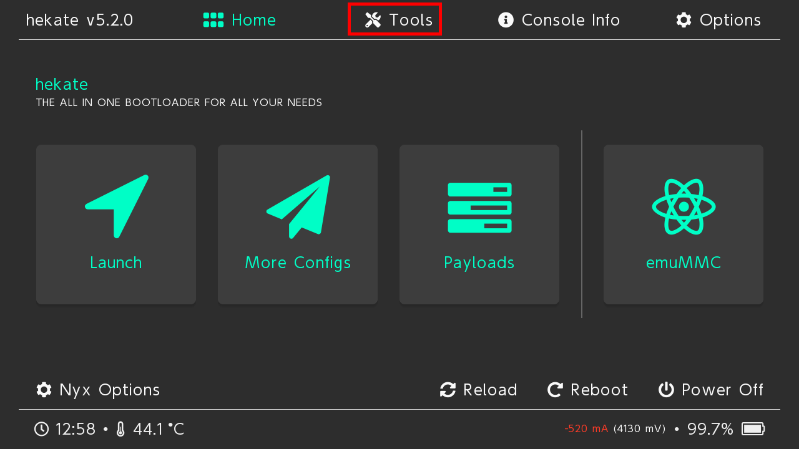</img>

2. 点击 Backup eMMC

   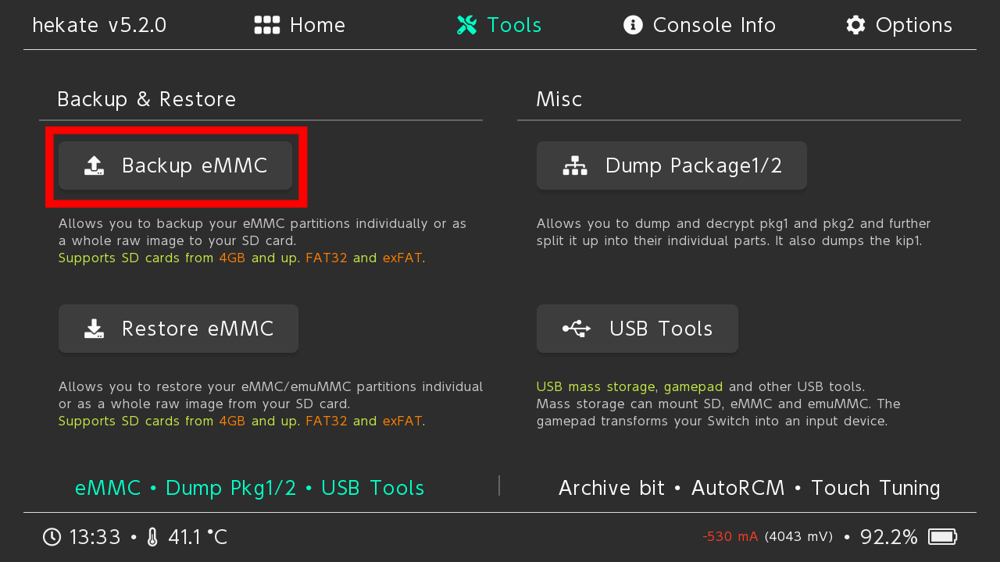</img>

3. 点击 eMMC BOOT0 & BOOT1

   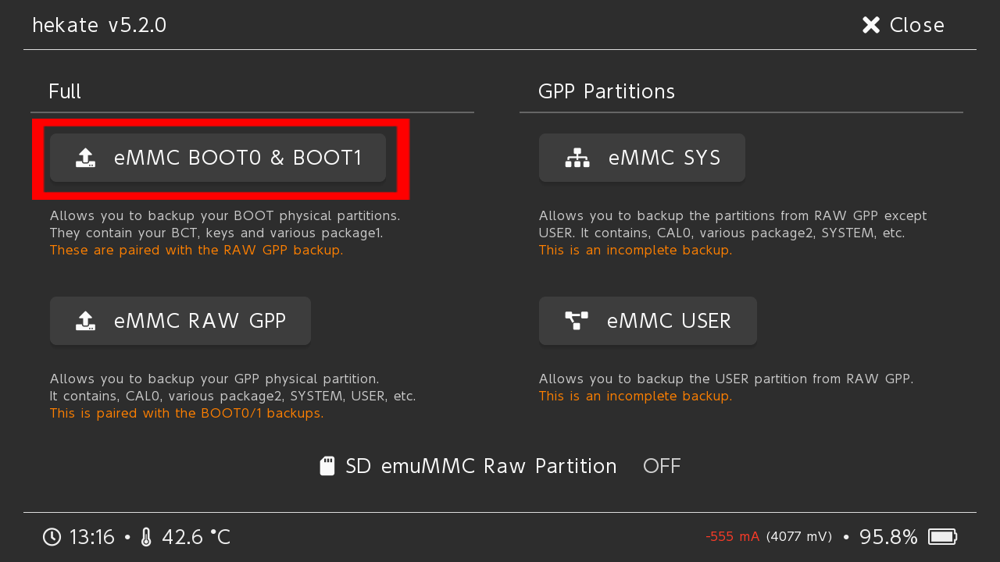</img>

4. 等待完成，点击 Close

   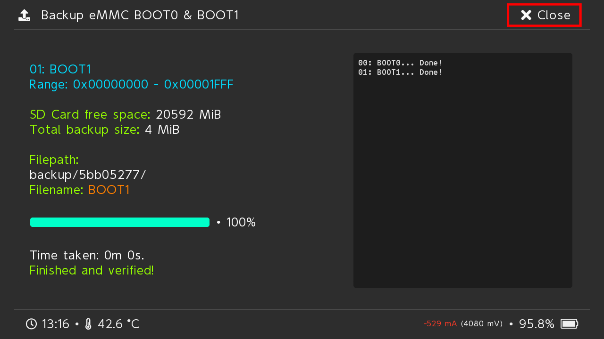</img>

5. 接下来点击 eMMC RAW GPP

   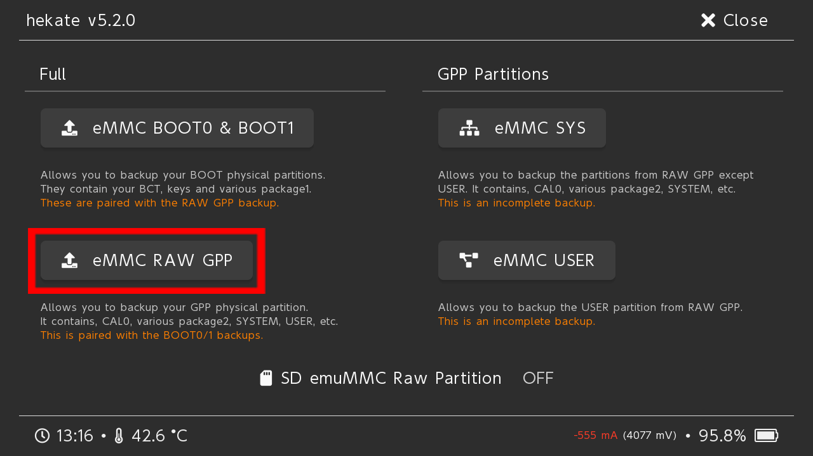</img>

6. 等待完成，点击 Close -> Home -> Power Off

   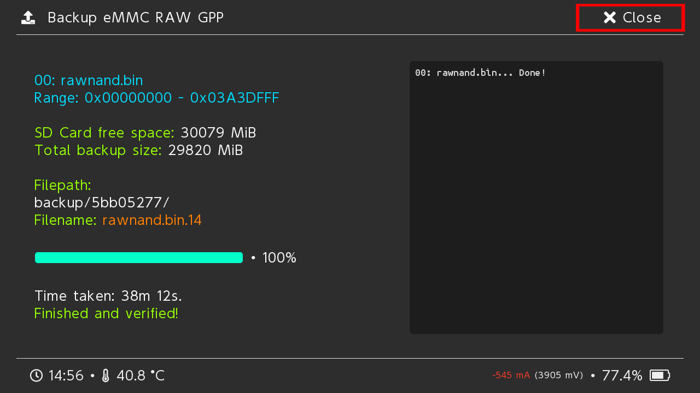</img>

7. 把 SD 卡插入电脑，复制 `backup` 文件夹到电脑。 备份成功的话，文件夹大小大概 32GB 左右。复制到电脑之后，就可以把 `backup` 文件夹删除了。

备份系统的英文原版教程是[Making a NAND backup](https://nh-server.github.io/switch-guide/user_guide/emummc/making_emummc/#making-a-nand-backup)

## 6. 安装虚拟系统

虚拟系统完全安装在 SD 卡内，可以保证不污染 Switch 内部存储，是比较推荐的安装方式。 目前安装方式有两种，`SD File` 和 `SD Partition`， 推荐后者，因为后者的读取速度更快。

1. 打开 Hekate， 选择 Tools， 然后点击 Partition SD Card

   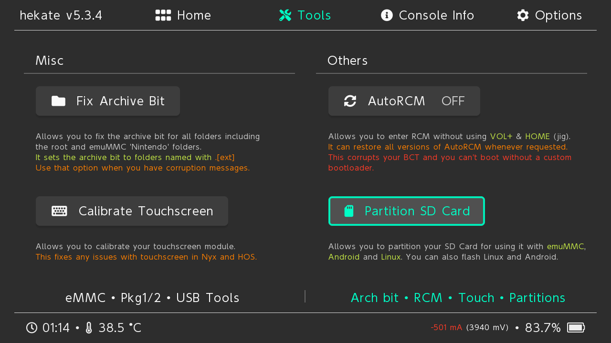</img>

2. 请保证 SD 卡的使用容量在 1 GB 以下，因为 1GB 以下会显示 `Your SD Card files will be backed up automatically!`。 1GB 以下会自动备份和恢复数据，否则需要自行备份数据。

   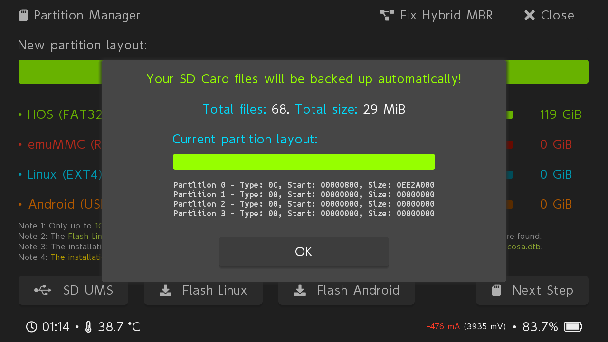</img>

3. 调整 emuMMC (RAW) 为 29 GiB，界面上会显示 `29 full`

   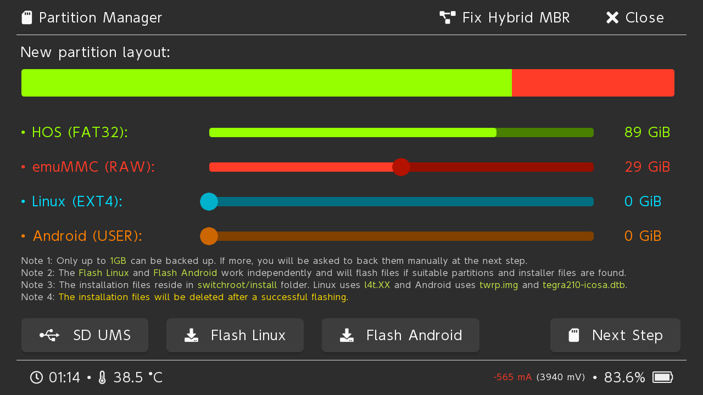</img>

4. 选择 `Next Step`，点击 `Start` 然后等待完成。

   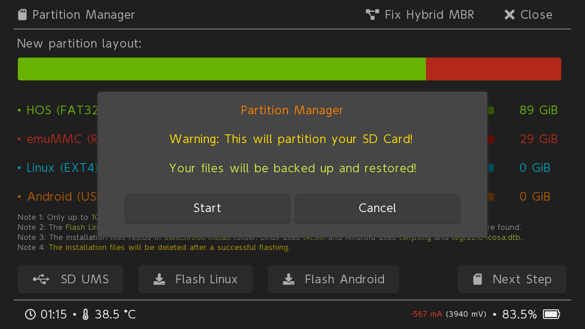</img>

5. 返回 Home，点击 `emuMMC`

   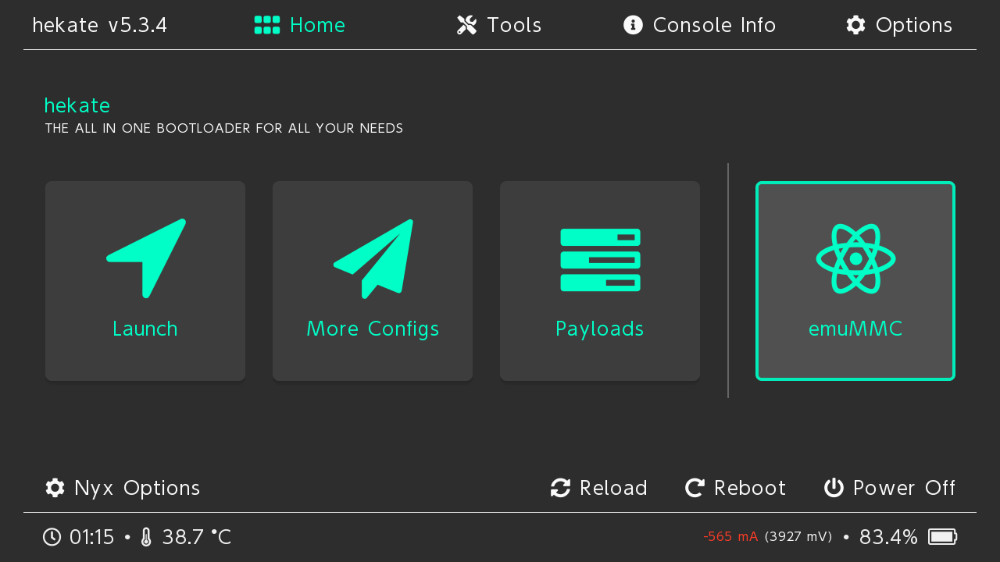</img>

6. 选择 `Create emuMMC`

   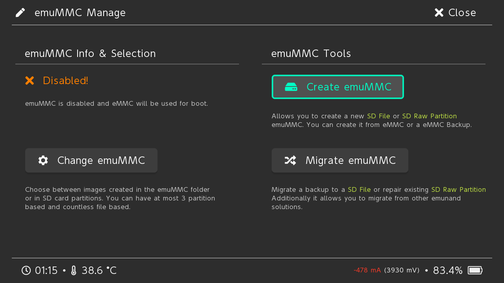</img>

7. 选择 `SD Partition`

   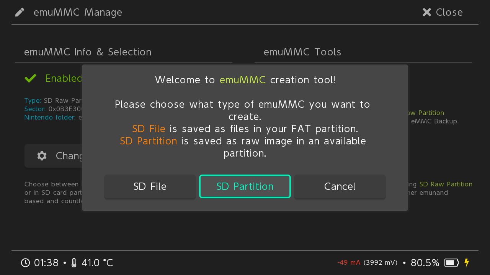</img>

8. 选择 `Part 1`

   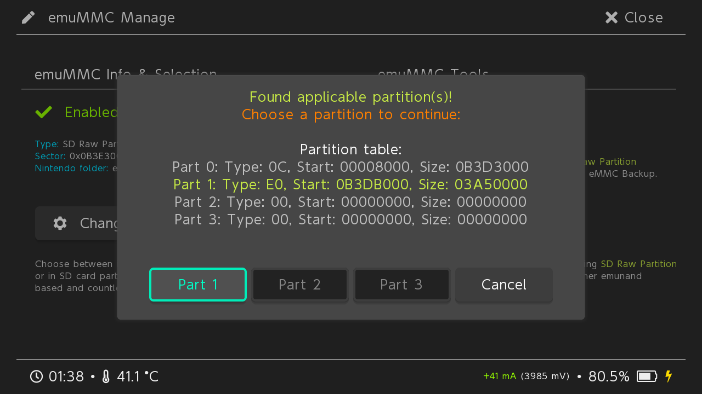</img>

9. 等待完成，点击 Close -> Home -> Launch ，选择 `Atmosphere Fusee CFW` 启动。然后就开始进入系统了。

10. 进入系统，查看系统设置，如果显示当前版本包含字母 `E` 说明成功进入虚拟系统了。

    </img>

安装虚拟系统的英文原版教程是[Create an emuMMC](https://switch.homebrew.guide/emummc/emummc.html)

## 7. 安装游戏

返回系统主界面，点击相册能看到大气层系统安装的一些软件。点击 `Tinfoil` 会自动安装到主界面，以后就不用进入相册来安装游戏了。

Tinfoil 支持[网络安装](https://blawar.github.io/tinfoil/network/)，这里推荐使用 `Samba` 方式来安装，PC 开启 SMB 共享之后，
使用 Switch 进行访问，既能解决 FAT32 不支持 4GB 以上文件，游戏无法复制到 SD 卡上的问题，又能避免每次安装都要关机插拔 SD 卡到电脑复制游戏。
不过联网之前记得使用[90DNS](https://gitlab.com/a/90dns)屏蔽任天堂服务器，避免机器被 ban。

游戏文件类型：

BASE 是游戏本体，一般版本号 1.0  
UPD 是游戏升级档，有版本号更新到系统  
DLC 是追加内容，主要是多点游戏内容

游戏格式：

NSP： **Nintendo Submission Package** 数字版游戏复制的格式。通常游戏本体和升级包需要分开安装。

XCI： **NX Card Image** 实体卡带复制的格式。通常会有整合包，安装的时候需要允许安装 XCI 内的 UPD 和 DLC。

NSZ： 压缩过后的 NSP 文件

XCZ： 压缩过后的 XCI 文件

## Tinfoil

Install Unsigned Code 安装未签署代码，需要输入密码：上 上 下 下 左 右 左 右 B A + 即可安装免签。

## 升级系统

1. 请先升级 Atmosphère，Hekate，Signature Patches，升级方法很简单下载最新版本到 SD 卡上，并且更新注入器的 `payload.bin`。
   需要先删除 `atmosphere` 和 `bootloader` 文件夹再复制，强行覆盖的话不能保证成功启动。

2. 到[Switch Firmwares](https://darthsternie.net/switch-firmwares/)去下载最新固件。并解压到 SD 卡根目录。

3. 使用 `Daybreak` 来安装更新，选择 `Install`，然后选择固件的安装目录。

4. 如果固件校验通过，点击 `Continue` 选择 `Preserve settings`, 如果可以选择 `Install (FAT32 + exFAT)` 就选这个，否则就选 `Install (FAT32)`。

5. 安装完成之后，点击重启就完成升级了。英文原版教程是[Updating CFW](https://nh-server.github.io/switch-guide/extras/updating/)

## 参考资料

[NH Switch Guide](https://nh-server.github.io/switch-guide/)

[Homebrew Guide](https://switch.homebrew.guide/)

[Switch Hacking Is Easy](https://rentry.co/SwitchHackingIsEasy)

[atmosphere-switch](https://github.com/esrrhs/atmosphere-switch)

[Switch](https://github.com/Zi-BOOM/Switch)
