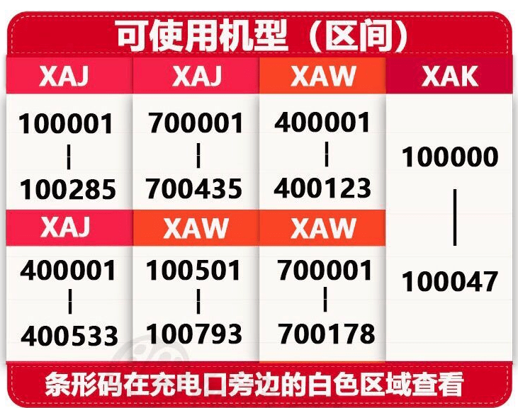

# switch

本手册基于自己的安装实践，仅供参考。

## 1. 准备工作

1. 可以软破的 Switch 机器

   Switch 破解分为软件破解和硬件破解。硬件破解技术难度高，不在讨论范围内。软件破解需要 2018 年 6 月之前出厂的机器，具体能破解的序列号请参考下图：
   </img>

2. [RCM 注入器 v5](https://www.xkitcn.com/rcmloader/)，某宝上有售，自行搜索

3. SD 卡，三星 EVO Plus 任天堂官方推荐

   关于 SD 卡的文件格式，推荐 FAT32，exFAT 虽然可以支持 4GB 以上大文件，但是并不稳定。详细可以参考[SD Preparation](https://nh-server.github.io/switch-guide/user_guide/sysnand/sd_preparation/)

## 2. 准备 SD 卡内容

软件清单：

1. [Atmosphère](https://github.com/Atmosphere-NX/Atmosphere/releases/latest) Switch 自定义操作系统

   下载 `atmosphere-xxx-master-173d5c2d3+hbl-xxx+hbmenu-xxx.zip` 并解压到 SD 卡根目录。下载 `fusee.bin` 复制到 `/bootloader/payloads/fusee.bin`。

2. [hekate](https://github.com/CTCaer/hekate/releases) Switch 引导文件

   下载 `hekate_ctcaer_xxx_Nyx_xxx.zip` 并解压到 SD 卡根目录。 这里有一个 `hekate_ctcaer_xxx.bin` 文件，注入器要使用。  
   把 RCM 注入器插入电脑，会识别为 U 盘，打开\ATMOSPHERE_HEKATE 文件夹，把刚才的 `hekate_ctcaer_xxx.bin` 复制为 payload.bin，然后拔掉。
